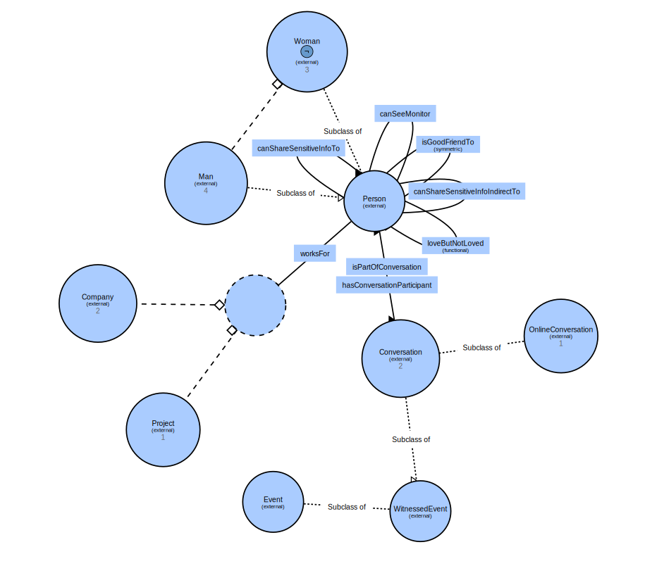

# Ontology project for LOGIC class ,Master's degree(AI), University of Sofia

Author: Borislav Markov

# Introduction

This ontology will describe a criminal story similar to
"soap opera" series.

# The soap criminal story
John works for a software company "Soap Academy International". 
The project that John works for has confidential information 
and is called "Robo Soap Strategy". John has a colleague Peter, 
who knows John very well, and they are friends. They work on the 
same confidential project. They always chat on company's messenger.
John and Peter have colleague Riki, who knows Peter, but doesn't
know John in person. John have colleague Sara, who works on the same
confidential project. Riki doesn't work for project "Robo Soap Strategy".
Laura also works for company "Soap Academy International" and is in love
with John, but she is in another building. John doesn't share her feelings.
John and Laura doesn't meet very often, only on company events. Riki
 loves Laura, but she doesn't pay attention to him.  Riki can do anything 
 to attract her. 
 
 There is another company called "Domestic Soap Software", concurrent of 
 "Soap Academy International". They have received sensitive info from 
 project "Robo Soap Strategy", and the information had been published online.
 This is a crime.
  
The local detective asks all people involved trying to get more evidence on the case.
He wants to know more about what happened in the last week.
He then understands that:
 * John doesn't work in the samebuilding with Peter
 * Peter, Laura and Riki works in the same building.
 * Laura loves John but is not loved from John.
 * Peter likes Laura but is not loved from Laura.
 * Riki works behind Peter and can see his monitor.
 * Peter doesn't lock his computer while he is away.
 * In the evening before leak in information witnesses say
    that Laura talked to her cousin Sam.
 * Sam works for "Domestic Soap Software".
 * Laura and Riki always talk in the kitchen in the office.

We will show how the detective finds the potential leak of 
information with the help of Apache Jen project and OWL DL language.

# Build the project

Maven and Java 11 should be installed before working with this project.

## Build
```shell script
mvn clean install
```

## Run
```shell script
mvn exec:java -Dexec.mainClass="bg.unisofia.bsmarkov.ont.CriminalDeduction"
```

# Inference

The story is described with CriminalStory.java;
CriminalInference.jav contains additional restrictions to be used as classes later on;
CriminalDeduction.java invokes 3 SPARQL queries to make deductions.

## Initial Ontology
Initial ontology contains only starting classes and later will 
be enhanced.



## Rules

The following rules have been used to create and orchestrate instances
with property "canShareSensitiveInfoIndirectTo" which helps later on in the queries.

```text
@prefix owl:  <http://www.w3.org/2002/07/owl#> .
@prefix sc:  <urn:soap/crime/ontology#> .


  [r1:
    (?pX sc:canShareSensitiveInfoIndirectTo ?p1),
    (?p1 sc:isPartOfConversation ?conv1),
    (?p2 sc:isPartOfConversation ?conv1),
    ->
    (?p1 sc:canShareSensitiveInfoTo ?p2)],

  [r1a:
    (?pX sc:canShareSensitiveInfoTo ?p1),
    (?p1 sc:isPartOfConversation ?conv1),
    (?p2 sc:isPartOfConversation ?conv1),
    ->
    (?p1 sc:canShareSensitiveInfoTo ?p2)],

  [r2:
    (?p1 sc:worksFor sc:roboSoapStrategyProject),
    (?p2 sc:worksFor sc:roboSoapStrategyProject),
   ->
    (?p1 sc:canShareSensitiveInfoTo ?p2),
    (?p2 sc:canShareSensitiveInfoTo ?p1)],

  [r3:
    (?pSomeone sc:canShareSensitiveInfoIndirectTo ?p1),
    (?p1 sc:isGoodFriendTo ?p2),
    (?p1 sc:loveButNotLovedProperty ?pX)
   ->
    (?p1 sc:canShareSensitiveInfoTo ?p2)],
  [r4:
    (?p1 sc:canShareSensitiveInfoTo ?p2),
    (?p2 sc:canShareSensitiveInfoTo ?p3)
   ->
    (?p1 sc:canShareSensitiveInfoIndirectTo ?p3)],
  [r5:
    (?p1 sc:canShareSensitiveInfoIndirectTo ?p2),
    (?p2 sc:canShareSensitiveInfoTo ?p3)
   ->
    (?p1 sc:canShareSensitiveInfoIndirectTo ?p3)],
  [r6:
    (?pSomeone sc:canShareSensitiveInfoIndirectTo ?p2),
    (?p1 sc:canSeeMonitor ?p2)
   ->
    (?p2 sc:canShareSensitiveInfoTo ?p1)]
```

## Additional Classes

Two additional classes are created with java.
```java
        // Create class that identifies people which can share sensitive info
        outOntology.createIntersectionClass(NS + "LeakInfoSourcePeople",
                outOntology.createList(
                        outOntology.createHasValueRestriction(null,
                                outOntology.getOntProperty(NS + "worksFor"),
                                outOntology.getIndividual(NS + "roboSoapStrategyProject")),
                        outOntology.createMinCardinalityRestriction(null,
                                outOntology.getOntProperty(NS + "canShareSensitiveInfoIndirectTo"), 1)));

        // Identify people who published the sensitive info
        outOntology.createHasValueRestriction(NS + "LeakInfoDestinationPeople",
                outOntology.getOntProperty(NS + "worksFor"),
                outOntology.getIndividual(NS + "domesticSoapSoftwareCompany"));

```

## SPARQL queries to make deductions

The leak of information is confirmed by this:

```text
PREFIX  rdf: <http://www.w3.org/1999/02/22-rdf-syntax-ns#>
PREFIX  owl: <http://www.w3.org/2002/07/owl#>
PREFIX  sc: <urn:soap/crime/ontology#>
SELECT ?insider ?outsider
WHERE { ?insider a sc:LeakInfoSourcePeople       ;
           sc:canShareSensitiveInfoIndirectTo ?outsider .
        ?outsider  a sc:LeakInfoDestinationPeople .
}
```
Outputs these results:
```text
 ===========================================
Result from query: confirm leak of information
----------------
Subject[insider]: urn:soap/crime/ontology#john}
Subject[outsider]: urn:soap/crime/ontology#sam}
----------------
Subject[insider]: urn:soap/crime/ontology#sara}
Subject[outsider]: urn:soap/crime/ontology#sam}
----------------
Subject[insider]: urn:soap/crime/ontology#peter}
Subject[outsider]: urn:soap/crime/ontology#sam}
===========================================
```      

Next query is to identify how the information left the project:
```text
PREFIX  rdf: <http://www.w3.org/1999/02/22-rdf-syntax-ns#>
PREFIX  owl: <http://www.w3.org/2002/07/owl#>
PREFIX  sc: <urn:soap/crime/ontology#>
SELECT ?insider ?outsider 
WHERE { ?insider a sc:LeakInfoSourcePeople       ;
           sc:canShareSensitiveInfoTo ?outsider .
     MINUS {
      ?outsider sc:worksFor sc:roboSoapStrategyProject
     }
}
```
which outputs this :
```text
===========================================
Result from query: where is leak of info from project
----------------
Subject[insider]: urn:soap/crime/ontology#peter}
Subject[outsider]: urn:soap/crime/ontology#riki}
===========================================
```

The last query identifies how the information probably left the company:

```text
PREFIX  rdf: <http://www.w3.org/1999/02/22-rdf-syntax-ns#>
PREFIX  owl: <http://www.w3.org/2002/07/owl#>
PREFIX  sc: <urn:soap/crime/ontology#>
SELECT DISTINCT ?insider ?outsider 
WHERE { ?x a sc:LeakInfoSourcePeople       ; 
           sc:canShareSensitiveInfoIndirectTo ?insider . 
        ?insider sc:canShareSensitiveInfoTo ?outsider. 
        ?insider sc:worksFor sc:soapAcademyIntCompany. 
     MINUS {
      ?outsider sc:worksFor sc:soapAcademyIntCompany
     }
}
```

This query returns:
```text
===========================================
Result from query: where is leak of info from company
----------------
Subject[insider]: urn:soap/crime/ontology#laura}
Subject[outsider]: urn:soap/crime/ontology#sam}
===========================================
```

So detective now knows the crime people are 
Riki who steal information from the project.
From the other side Laura shared info to outsider Sam.

 